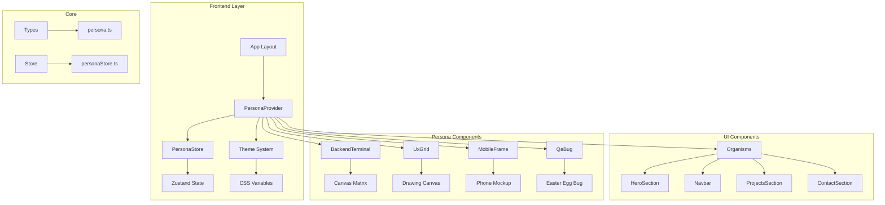

# Architecture Map — Universo Emanuel

## 1. Visão Geral

O **Universo Emanuel** utiliza uma arquitetura de **Micro-Frontends Lógicos** dentro de um monorepo Next.js, onde cada "Persona" atua como um domínio visual e funcional distinto, mas compartilhando o mesmo núcleo de dados e lógica.

## 2. Diagrama de Arquitetura



## 3. Fluxo de Dados

```
User Action (Click Persona)
        │
        ▼
usePersonaStore.setPersona()
        │
        ▼
PersonaProvider detects change
        │
        ▼
document.body.setAttribute('data-theme', personaId)
        │
        ▼
CSS Variables updated
        │
        ▼
AnimatePresence triggers
        │
        ▼
New Persona Components Rendered
```

## 4. Módulos e Responsabilidades

### Core Module (`src/core/`)
| Arquivo | Responsabilidade |
|---------|-----------------|
| `types/persona.ts` | Definições de tipos TypeScript |
| `store/personaStore.ts` | Estado global via Zustand |

### Components Module (`src/components/`)
| Arquivo | Responsabilidade |
|---------|-----------------|
| `providers/PersonaProvider.tsx` | Wrapper que injeta tema e gerencia animações |
| `organisms/Navbar.tsx` | Navegação responsiva |
| `organisms/HeroSection.tsx` | Seção hero dinâmica |
| `organisms/ProjectsSection.tsx` | Grid de projetos |
| `organisms/ContactSection.tsx` | Seção de contato |
| `personas/BackendTerminal.tsx` | Canvas Matrix |
| `personas/UxGrid.tsx` | Grid + Canvas desenhável |
| `personas/MobileFrame.tsx` | Mockup iPhone |
| `personas/QaBug.tsx` | Bug interativo |

### App Module (`src/app/`)
| Arquivo | Responsabilidade |
|---------|-----------------|
| `layout.tsx` | Root layout com fontes e providers |
| `page.tsx` | Home page com todas seções |
| `globals.css` | Tokens CSS e temas |

## 5. Principais Dependências

```json
{
  "next": "14.1.0",
  "react": "^18.2.0",
  "framer-motion": "^11.0.0",
  "zustand": "^4.5.0",
  "tailwindcss": "^3.4.1",
  "lucide-react": "^0.300.0",
  "clsx": "^2.1.0",
  "tailwind-merge": "^2.2.0"
}
```

## 6. Pontos Críticos

1. **PersonaProvider:** Gerencia transições e temas - qualquer bug aqui quebra todo o sistema
2. **CSS Variables:** Devem cobrir todos os tokens do Tailwind (background, foreground, primary, etc.)
3. **Zustand Store:** Estado centralizado - adicionar novos estados aqui requer atenção

## 7. Dívidas Técnicas

- [ ] Adicionar `Card` e `Button` components reutilizáveis (atoms)
- [ ] Extrair dados de projetos para arquivo JSON
- [ ] Implementar `useScrollPosition` hook para animações baseadas em scroll
- [ ] Adicionar testes E2E (Playwright)
- [ ] Configurar Storybook para component visualization

## 8. Decisões Arquiteturais Registradas

| Data | Decisão | Status |
|------|---------|--------|
| 2026-06-30 | Next.js 14 App Router | ✅ Aceita |
| 2026-06-30 | Zustand para estado global | ✅ Aceita |
| 2026-06-30 | CSS Variables para theming | ✅ Aceita |
| 2026-06-30 | Framer Motion para animações | ✅ Aceita |
| 2026-06-30 | Feature-based folder structure | ✅ Aceita |

## 9. Integrações Externas (Futuro)

- **GitHub API:** Buscar repositórios em tempo real
- **YouTube API:** Embedar vídeos de coding sessions
- **Vercel Analytics:** Métricas de acesso
- **Contentlayer:** CMS via MDX
